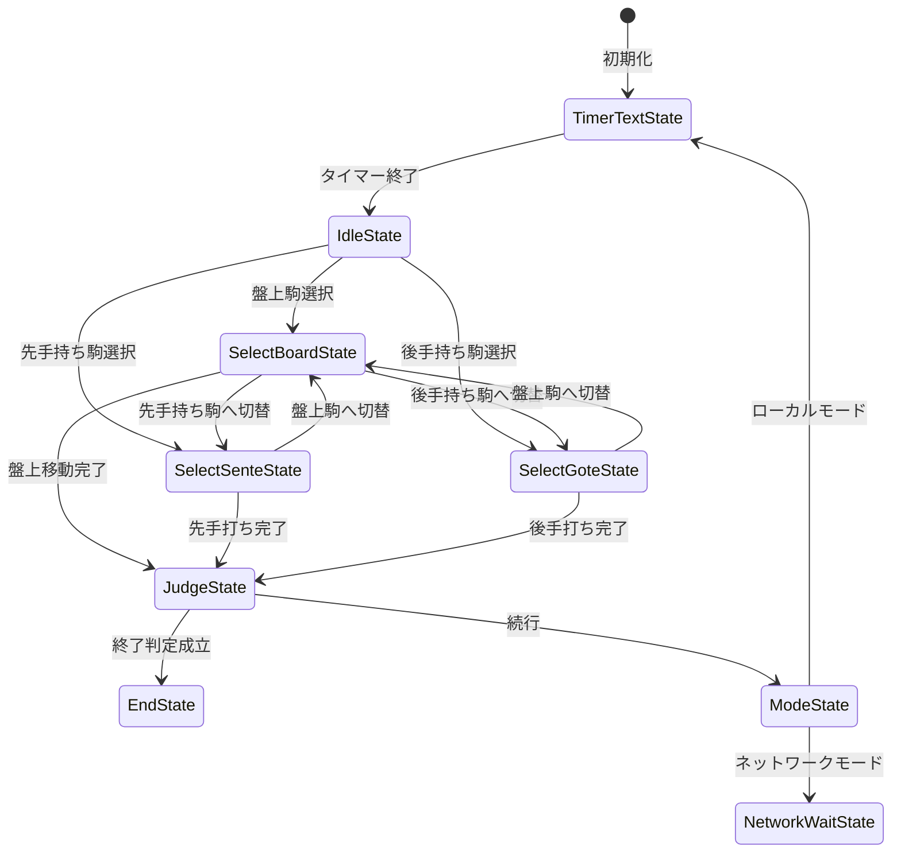

# Online_Shogi

## プロジェクト概要

Online_ShogiはUnityで作られた将棋系オンラインボードゲームのプロジェクトです。
ゲームの状態管理にはStateパターンを採用し、入力処理と描画は分離されています。
現在の実装ではローカル対戦を中心に、盤上の駒操作・持ち駒の打ち込み・勝敗判定を扱います。

## ファイル構成と役割

### ルート

- `README.md`
  - このプロジェクトの構成とゲームループを説明します。

### シーン管理

- `Assets/SceneLoader/Script/SceneLoader.cs`
  - `SceneType`に応じてタイトルシーンとローカルゲームシーンを切り替えます。
  - `LoadScene()` で `SceneManager.LoadScene(...)` を呼び出します。

### 初期化と起動

- `Assets/Bootstrap/Script/MonoBehaviour/Bootstrap.cs`
  - ゲーム起動時に `GameManager`、`GameViewer`、`StateMachine` を初期化します。
  - `Start()` で `Init()` を呼び出し、ゲーム状態の開始準備を整えます。

### ゲーム状態管理

- `Assets/StateMachine/Script/MonoBehaviour/StateMachine.cs`
  - 現在の `State` を保持し、クリックイベントを現在状態に委譲します。
  - `Init()` で `GameContext` を生成し、最初に `TimerTextState` を経由して `IdleState` を開始します。
  - `ChangeState(State state)` で現在状態の `Exit()` を呼び、次状態の `Enter()` を呼び出します。

### ルールと盤面管理

- `Assets/GameManager/Script/MonoBehaviour/GameManager.cs`
  - 盤上と持ち駒のデータを保持します。
  - 盤面の駒移動、成り判定、持ち駒の追加、セル状態の変更などを管理します。
  - `Init()` で `InitializePiece()` と `InitializeCell()` により盤面状態を初期化します。

### 描画とビュー

- `Assets/GameViewer/Script/GameViewer.cs`
  - `GameManager` のデータを読み取り、駒・セル・持ち駒の表示を生成・更新します。
  - `BuildAll()` / `BuildBoard()` / `BuildSenteHand()` / `BuildGoteHand()` などの描画メソッドを提供します。

### 入力処理

- `Assets/InputSystemActions.cs`
  - Unity Input Systemの生成コードです。
  - `StateMachine` の `OnClick` を呼び出すためのクリックイベントを提供します。

### 状態クラス

- `Assets/StateMachine/Script/State/IdleState.cs`
  - 何も選択していない待機状態。
  - 盤面駒、先手持ち駒、後手持ち駒の選択を受け付けます。
- `Assets/StateMachine/Script/State/SelectBoardState.cs`
  - 盤上の駒を選択した後の状態。
  - 移動先の選択や別の駒の再選択を処理します。
- `Assets/StateMachine/Script/State/SelectSenteState.cs`
  - 先手の持ち駒を選択した状態。
  - 打つ位置の選択や盤上駒への切り替えを処理します。
- `Assets/StateMachine/Script/State/SelectGoteState.cs`
  - 後手の持ち駒を選択した状態。
  - 打つ位置の選択や盤上駒への切り替えを処理します。
- `Assets/StateMachine/Script/State/JudgeState.cs`
  - 手番が終わった後に勝敗判定を行う状態。
  - 終了条件なら `EndState`、続行なら `ModeState` へ遷移します。
- `Assets/StateMachine/Script/State/ModeState.cs`
  - ゲームモードに応じて次の状態を決定します。
  - ローカルモードなら `TimerTextState` を経て `IdleState` に戻ります。
  - ネットワークモードなら `NetworkWaitState` へ遷移します。
- `Assets/StateMachine/Script/State/TimerTextState.cs`
  - 文字メッセージを表示し、指定時間後に次の状態へ遷移します。
- `Assets/StateMachine/Script/State/EndState.cs`
  - 勝者表示を行う終了状態です。

### 共通コンテキスト

- `Assets/StateMachine/Script/Class/Module/GameContext.cs`
  - `State` 間で共有されるモジュールをまとめます。
  - `MachineModule`、`ManagerModule`、`ViewerModule`、`TurnModule`、`TextModule`、`ResultModule`、`JudgeModule`、`ModeModule` を保持します。

## ゲームループとState遷移

このプロジェクトでは、ゲームループは `StateMachine` の状態遷移とイベント委譲によって実現されています。
クリック入力は `StateMachine.OnClick(Vector2 pos)` に渡され、現在の `State` が処理を行います。
状態遷移は `currentState.Exit()` → `currentState = nextState` → `currentState.Enter()` で実行されます。

1. `Bootstrap.Start()` で `StateMachine.Init()` が呼ばれる
2. `StateMachine` は `GameContext` を生成し、先手ターンを設定
3. 最初に `TimerTextState` が開始され、メッセージ表示後に `IdleState` へ遷移
4. `IdleState` で駒選択を待ち、ユーザーのクリックに応じて `SelectBoardState` / `SelectSenteState` / `SelectGoteState` へ移動
5. 選択状態で駒移動・打ち込みが完了したら `JudgeState` に遷移し、勝敗判定を実行
6. 勝者が決まれば `EndState` へ、続行なら `ModeState` へ移行
7. `ModeState` でモードを判定し、ローカルなら再び `TimerTextState` から `IdleState` へ戻る

### 状態遷移図

## 重要な設計ポイント

- `StateMachine` は主に「現在の状態」と「クリックイベントの受け渡し」を担当します。
- `GameManager` はルールに関わるデータ操作を担当し、状態遷移そのものは行いません。
- `GameViewer` は描画を担当し、ロジックを持ちません。
- `TimerTextState` により、ターン開始時の一時停止表示が実現されています。
- `JudgeState` で勝敗を判定し、`EndState` もしくは再開ルートへ分岐します。

## 今後の拡張候補

- `ModeState` のネットワークモード実装を進める
- `State` の共通処理を整理して `IdleState` / `Select*State` の重複を減らす
- `GameManager` の責務分離を進めて、盤面・手番・持ち駒の管理をより明確にする
- タイトルシーンやゲームセット画面を追加する
