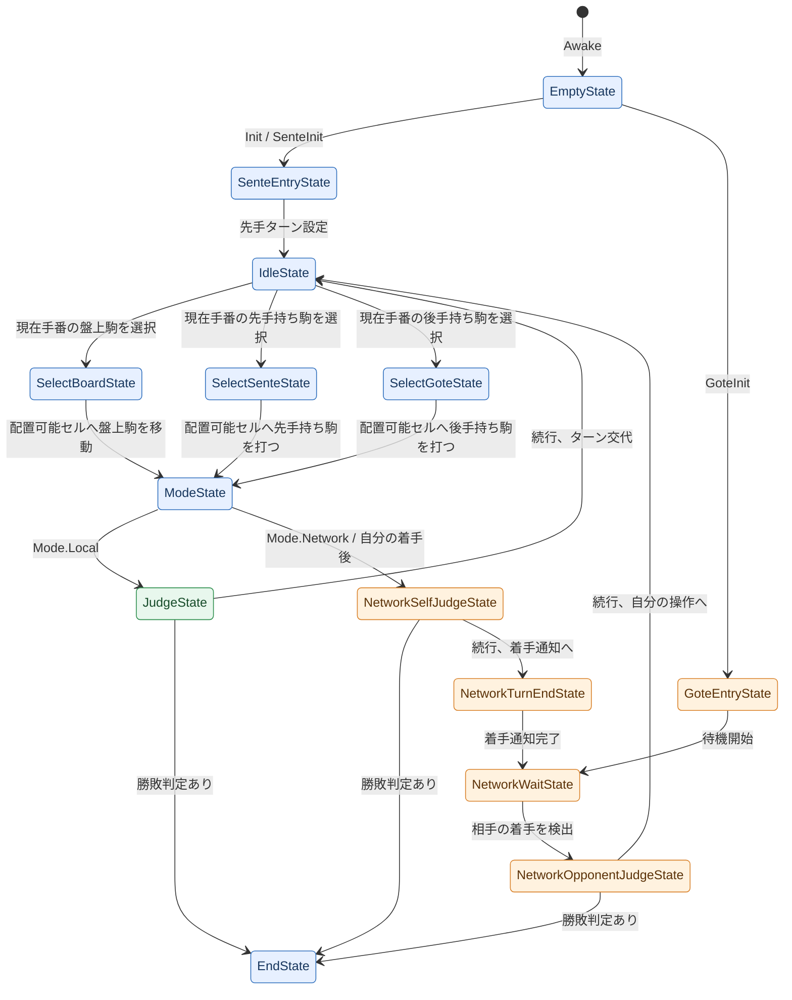

# Online_Shogi

## プロジェクト概要

Online_ShogiはUnityで作られた将棋系オンラインボードゲームのプロジェクトです。
ゲームの状態管理にはStateパターンを採用し、入力処理と描画は分離されています。
現在の実装ではローカル対戦を中心に、盤上の駒操作・持ち駒の打ち込み・勝敗判定を扱います。

## ファイル構成と役割

### ルート

- `README.md`
  - このプロジェクトの構成とゲームループを説明します。

### シーン管理

- `Assets/SceneLoader/Script/SceneLoader.cs`
  - `SceneType`に応じてタイトルシーンとローカルゲームシーンを切り替えます。
  - `LoadScene()` で `SceneManager.LoadScene(...)` を呼び出します。

### 初期化と起動

- `Assets/Bootstrap/Script/MonoBehaviour/Bootstrap.cs`
  - ゲーム起動時に `GameManager`、`GameViewer`、`StateMachine` を初期化します。
  - `Start()` で `Init()` を呼び出し、ゲーム状態の開始準備を整えます。

### ゲーム状態管理

- `Assets/StateMachine/Script/MonoBehaviour/StateMachine.cs`
  - 現在の `State` を保持し、クリックイベントを現在状態に委譲します。
  - `Init()` で `GameContext` を生成し、最初の待機状態を開始します。
  - `ChangeState(State state)` で現在状態の `Exit()` を呼び、次状態の `Enter()` を呼び出します。

### ルールと盤面管理

- `Assets/GameManager/Script/MonoBehaviour/GameManager.cs`
  - 盤上と持ち駒のデータを保持します。
  - 盤面の駒移動、成り判定、持ち駒の追加、セル状態の変更などを管理します。
  - `Init()` で `InitializePiece()` と `InitializeCell()` により盤面状態を初期化します。

### 描画とビュー

- `Assets/GameViewer/Script/GameViewer.cs`
  - `GameManager` のデータを読み取り、駒・セル・持ち駒の表示を生成・更新します。
  - `BuildAll()` / `BuildBoard()` / `BuildSenteHand()` / `BuildGoteHand()` などの描画メソッドを提供します。

### 入力処理

- `Assets/InputSystemActions.cs`
  - Unity Input Systemの生成コードです。
  - `StateMachine` の `OnClick` を呼び出すためのクリックイベントを提供します。

### 状態クラス

- `Assets/StateMachine/Script/State/IdleState.cs`
  - 何も選択していない待機状態。
  - 盤面駒、先手持ち駒、後手持ち駒の選択を受け付けます。
- `Assets/StateMachine/Script/State/SelectBoardState.cs`
  - 盤上の駒を選択した後の状態。
  - 移動先の選択を処理します。
- `Assets/StateMachine/Script/State/SelectSenteState.cs`
  - 先手の持ち駒を選択した状態。
  - 打つ位置の選択を処理します。
- `Assets/StateMachine/Script/State/SelectGoteState.cs`
  - 後手の持ち駒を選択した状態。
  - 打つ位置の選択を処理します。
- `Assets/StateMachine/Script/State/JudgeState.cs`
  - 手番が終わった後に勝敗判定を行う状態。
  - 終了条件なら `EndState`、続行なら `ModeState` へ遷移します。
- `Assets/StateMachine/Script/State/ModeState.cs`
  - ゲームモードに応じて次の状態を決定します。
  - ローカルモードなら次の判定処理へ進みます。
  - ネットワークモードなら自分の着手後のネットワーク勝敗判定へ遷移します。
- `Assets/StateMachine/Script/State/NetworkWaitState.cs`
  - ネットワーク対戦時に相手の手を待つ状態です。
- `Assets/StateMachine/Script/State/NetworkJudgeState.cs`
  - ネットワーク対戦で勝敗判定を行います。
  - README上では、入口と出口を分かりやすくするため「自分の着手後」と「相手の着手後」に分けて説明します。
- `Assets/StateMachine/Script/State/EndState.cs`
  - 勝者表示を行う終了状態です。
- `Assets/StateMachine/Script/State/SenteEntryState.cs`
  - 先手ターン開始時の入口です（現状では未使用）。
- `Assets/StateMachine/Script/State/GoteEntryState.cs`
  - ネットワーク対戦の接続待ち開始状態です（現状では未使用）。

### 共通コンテキスト

- `Assets/StateMachine/Script/Class/Module/GameContext.cs`
  - `State` 間で共有されるモジュールをまとめます。
  - `MachineModule`、`ManagerModule`、`ViewerModule`、`TurnModule`、`TextModule`、`ResultModule`、`JudgeModule`、`ModeModule` を保持します。

## ゲームループとState遷移

このプロジェクトでは、`StateMachine` が現在の `State` を保持し、入力イベントを現在状態へ委譲します。
状態遷移は `ChangeState(State state)` に集約され、`currentState.Exit()` → `currentState = state` → `currentState.Enter()` の順で実行されます。
`Assets/StateMachine/Script/State` 配下の主要なStateが、起動直後の空状態、ローカル対戦、ネットワーク対戦、終了表示までを分担しています。

### 起動と初期化

1. `StateMachine.Awake()` で `IInputProvider` と `IGameManager` を取得し、仮の現在状態として `EmptyState` を設定します。
2. `StateMachine.Start()` で `BoardConverter` に `BoardConfig` を渡し、クリックイベントを `OnClick(Vector2 pos)` に接続します。
3. 通常起動では `Init()` が `GameContext` を生成し、`context.turn.SetTurn(Team.Sente)` のあと `SenteEntryState` を開始します。
4. `SenteEntryState.Enter()` は先手ターンを設定し、待機状態の `IdleState` へ進みます。
5. ネットワーク側の初期化では `SenteInit()` または `GoteInit()` も使われます。`GoteInit()` は `GoteEntryState` から `NetworkWaitState` へ入ります。

### 各Stateの役割と遷移条件

- `EmptyState`
  - `Awake()` 時点の仮状態です。
  - `Enter()` / `Exit()` / `OnClick()` は何もしません。

- `SenteEntryState`
  - 先手開始用の入口です。
  - `Enter()` で `Team.Sente` を現在ターンに設定し、`IdleState` へ遷移します。

- `GoteEntryState`
  - 後手側、またはネットワーク待機開始用の入口です。
  - `Enter()` でターンを `Team.Sente` に設定し、`NetworkWaitState` へ遷移します。

- `IdleState`
  - 駒未選択の待機状態です。
  - `Enter()` でセル選択状態を消し、全体を再描画します。
  - 盤上クリックが `BoardConverter.WorldToBoard()` に成功し、クリック先に現在手番の駒がある場合は `SelectBoardState` へ遷移します。
  - 先手持ち駒クリックが `WorldToSenteHand()` に成功し、クリック先に現在手番の駒がある場合は `SelectSenteState` へ遷移します。
  - 後手持ち駒クリックが `WorldToGoteHand()` に成功し、クリック先に現在手番の駒がある場合は `SelectGoteState` へ遷移します。

- `SelectBoardState`
  - 盤上の駒を選択中の状態です。
  - 盤上クリック先が `context.manager.IsPlaceable(boardPos)` を満たす場合、選択中の盤上駒を移動し、セルを消して `ModeState` へ遷移します。

- `SelectSenteState`
  - 先手持ち駒を選択中の状態です。
  - 盤上クリック先が配置可能なら `MoveFromSenteHand()` で駒を打ち、セルを消して `ModeState` へ遷移します。

- `SelectGoteState`
  - 後手持ち駒を選択中の状態です。
  - 盤上クリック先が配置可能なら `MoveFromGoteHand()` で駒を打ち、セルを消して `ModeState` へ遷移します。

- `ModeState`
  - 一手完了後に、ローカル対戦とネットワーク対戦の進行先を分岐します。
  - `Mode.Local` の場合は `JudgeState` へ遷移します。
  - `Mode.Network` の場合は、自分の着手後のネットワーク勝敗判定へ遷移します。

- `JudgeState`
  - ローカル対戦の勝敗判定状態です。
  - `context.judge.IsEnd(out winner)` が真なら `EndState` へ遷移します。
  - 続行する場合は `context.turn.ChangeTurn()` を実行し、`IdleState` へ遷移します。

- `NetworkJudgeState`（自分の着手後）
  - `ModeState` から入ります。
  - ネットワーク対戦の勝敗判定を行い、終了条件を満たす場合は `EndState` へ遷移します。
  - 続行する場合はターンを交代し、`NetworkTurnEndState` へ遷移します。

- `NetworkTurnEndState`
  - 自分の手が完了したことをネットワーク側に通知する状態です。
  - `context.manager.SignalMove(movedTeam)` を呼び、`NetworkWaitState` へ遷移します。

- `NetworkWaitState`
  - 相手の手を待つ状態です。
  - `Enter()` で「待機中...」を表示し、`WaitForMoveCoroutine()` を開始します。
  - `GetMoveSignal()` が変化し、かつ `GetLastMovedTeam()` が待機中のチームと一致したら相手の着手完了とみなし、相手の着手後のネットワーク勝敗判定へ遷移します。
  - 待機中は0.5秒ごとに `context.viewer.BuildAll()` で表示を更新します。

- `NetworkJudgeState`（相手の着手後）
  - `NetworkWaitState` から入ります。
  - ネットワーク対戦の勝敗判定を行い、終了条件を満たす場合は `EndState` へ遷移します。
  - 続行する場合はターンを交代し、自分の操作待ちである `IdleState` へ遷移します。

- `EndState`
  - 対局終了状態です。
  - `Enter()` で全体を再描画し、`"{winner}の勝ち！"` を結果パネルに表示します。
  - クリックによる遷移はありません。

### 状態遷移図

図中の `NetworkSelfJudgeState` と `NetworkOpponentJudgeState` は、`NetworkJudgeState` を入口別に分けた説明用の名前です。
色は、共通の流れを青、ローカル特有の流れを緑、ネットワーク特有の流れをオレンジで示します。

- 共通の流れは、起動、駒選択、着手完了、終了表示など、ローカル対戦とネットワーク対戦の両方で使う部分です。
- ローカル特有の流れは、自分の端末内だけで勝敗判定を行い、そのまま次の手番へ戻る部分です。
- ネットワーク特有の流れは、自分の着手後に勝敗判定と着手通知を行い、相手の着手を待ってから再び自分の操作へ戻る部分です。
- `ModeState` でローカルとネットワークに分岐し、対局が続く場合はいずれも `IdleState` に戻ります。

## 重要な設計ポイント

- `StateMachine` は主に「現在の状態」と「クリックイベントの受け渡し」を担当します。
- `GameManager` はルールに関わるデータ操作を担当し、状態遷移そのものは行いません。
- `GameViewer` は描画を担当し、ロジックを持ちません。
- `JudgeState` で勝敗を判定し、`EndState` もしくは再開ルートへ分岐します。

## 開発の歩み（Git履歴からの工程）

`git rev-list --count HEAD` で確認した現在の履歴は155コミットです。
初期コミットから現在の `7d355c3` までを時系列に追うと、ローカル将棋の土台を作り、StateMachineでゲームループを整理し、その後Photon Fusionによるオンライン対戦へ広げていく流れになっています。

1. `ce2c287` - `d4fa146`（2026-04-25）
   - リポジトリを作成し、READMEの初期説明を置きました。

2. `713c9b5`（2026-04-25）
   - Unityプロジェクトを初期化し、Packages、ProjectSettings、SampleScene、Input System設定を追加しました。

3. `d2f7f5d` - `32a9ad3`（2026-04-25）
   - 駒の基本モデル、移動パターン、表示用 `PieceView`、`PieceData` を追加しました。
   - 駒画像と駒データの修正により、将棋の駒をデータとして扱う基礎を作りました。

4. `0527789`（2026-04-25）
   - `MovePatternEditor` と `PieceDebugger` を追加し、先手・後手の各駒データをScriptableObjectとして整備しました。

5. `d26e55a` - `46969c0`（2026-04-25）
   - 盤面セルのクラス、表示、色設定、Prefabを追加しました。
   - セルのアウトライン表示を加え、選択や移動候補の見た目を作れるようにしました。

6. `ffd215c` - `90ba66c`（2026-04-25）
   - `GameManager`、盤面初期配置、`BoardSetupEditor`、`PiecePlacement` を追加しました。
   - 駒・セル・盤面を管理する最初の中核ができ、`feature/create-GameManager` が統合されました。

7. `c4d9d7a` - `6bbfffe`（2026-04-26）
   - `PieceFactory`、デバッグ用メソッド、盤面取得メソッド、Prefab連携を追加しました。
   - `GameViewer` と `Build` 系メソッドにより、`GameManager` のデータを画面に構築する流れを作り、`feature/add-GameViewer` を統合しました。

8. `75d8f27` - `785cda6`（2026-04-26 - 2026-04-27）
   - 入力状態管理の試作として `IInputState`、入力State、`LocalInputStateMachine` を追加しました。
   - `BoardConfig` と `BoardConverter` を追加し、ワールド座標を盤面・持ち駒領域へ変換する準備をしました。
   - Text UI、`TextManager`、`IInputProvider`、`LocalInputAdapter` を追加し、入力レイヤーをStateMachineへつなげる方向に整理しました。

9. `c8ed556` - `307ae77`（2026-04-27）
   - `StateMachine` に入力アダプターを接続し、`BoardConverter` と `LocalInputAdapter` を修正しました。
   - 空きマス取得、移動可能位置取得を追加し、クリック後に合法手候補を出すためのルール処理を強化しました。

10. `5e9bddd` - `1c05da1`（2026-04-27 - 2026-04-28）
    - シーン保存、`GameManager` のgetter類、持ち駒表示、選択中の駒位置、配置可能判定を追加しました。
    - 表示まわりを修正し、StateMachineの初期化と基本ゲームループを整えました。
    - この段階で「駒を選択し、移動し、表示を更新する」基本操作が成立しました。

11. `e8258ef` - `d53a2d7`（2026-04-28 - 2026-04-29）
    - 選択系Stateを追加・修正し、盤上駒と持ち駒の選択フローを整理しました。
    - `StateModule` のネストクラス化、選択駒取得、配置可能判定の修正により、StateからGameManagerへ処理を委譲する形が明確になりました。

12. `241c3d2` - `8e54ab0`（2026-04-29 - 2026-04-30）
    - READMEを更新し、`GameManager` / `GameViewer` を修正しました。
    - 持ち駒削除処理と `Bootstrap` を追加し、シーン開始時に各コンポーネントを初期化する構成にしました。

13. `24c9ab5` - `e170cba`（2026-04-30 - 2026-05-01）
    - READMEに実装計画を追加し、カメラサイズを調整しました。
    - `feature/edit-statemachine-and-states` が統合され、StateMachineとState群の設計が一段落しました。

14. `6a8c626` - `5f0310a`（2026-05-01）
    - `GameState`、判定用モジュール、`JudgeState` を追加しました。
    - 不要Stateを削除し、`IState` から抽象クラス `State` へリファクタリングしました。
    - `feature/add-judge-system` が統合され、勝敗判定を含むローカル対戦ループが成立しました。

15. `0f0ea5a` - `f310bae`（2026-05-01）
    - `TitleScene` と `SceneLoader` を追加し、シーン遷移を開始しました。
    - 結果パネル、`TextManager.ShowResult()`、`EndState` の勝者表示を追加しました。
    - `GameContext` を導入し、State間で `Machine`、`Manager`、`Viewer`、`Turn`、`Text`、`Result`、`Judge` を共有する構造へリファクタリングしました。

16. `f9d0cfc` - `6327994`（2026-05-03 - 2026-05-04）
    - `IGameManager` を導入し、ローカル用 `GameManager` とネットワーク用 `NetworkGameManager` を同じState群から扱えるようにしました。
    - Photon Fusionを導入し、オンライン対戦用の依存と基盤を追加しました。
    - `feature/add-IGameManager` が統合され、ゲーム管理の抽象化が進みました。

17. `19d16ef` - `84bd9f1`（2026-05-04）
    - `SenteEntryState`、`GoteEntryState`、`ModeState`、`NetworkWaitState`、`NetworkJudgeState` を追加しました。
    - `ModeModule` により `Mode.Local` / `Mode.Network` の分岐をState内で扱えるようにしました。
    - Singleton依存を廃止し、`GameManager`、`GameViewer`、`TextManager` を参照注入型へ寄せました。

18. `de10cd2` - `98101f6`（2026-05-05）
    - `NetworkGameManager` を修正し、`Assets/Network` 配下へネットワーク関連を分離しました。
    - `NetworkGameLauncher`、`NetworkRunner`、`NetworkGameManager` のPrefabと `NetworkGameScene` を追加しました。
    - BuildSettingsに `LocalGameScene` を追加し、READMEにもネットワークStateの説明を反映しました。
    - `feature/add-network-states` が統合され、ネットワーク対戦のState構成が入ります。

19. `ce8f2d1` - `3ff8c74`（2026-05-05 - 2026-05-06）
    - READMEを更新し、シーン保存とそのRevertを経て、現在シーンの保存内容を整理しました。
    - `Bootstrap` から `SetGameManager` 呼び出しを外し、ネットワーク起動側の責務へ寄せました。
    - `PieceType` などのenumにbyte定義を追加し、関連アセットを修正しました。

20. `057f1a4` - `8a36d20`（2026-05-06）
    - `NetworkGameManager` の移動可能位置取得、セルクリア、ネットワーク変数、`GameState` enum除去を進めました。
    - `IsMoved`、ターン管理、`NetworkTurnEndState` を追加し、ネットワーク対戦で自分の手と相手の手を分ける準備をしました。

21. `0926a30` - `553d69b`（2026-05-06）
    - `NetworkGameLauncher` と `NetworkGameManager` の開始タイミングを調整しました。
    - `NetworkWaitState` の待機ロジックを何度も修正し、`MoveSignal` と `LastMovedTeam` を使ったカウンター方式に整理しました。
    - 一度入れた修正をRevertし、チーム情報を含むカウンター方式として再構築しています。

22. `1b33bbd` - `9396565`（2026-05-06 - 2026-05-07）
    - ネットワーク描画更新のために `Render` 系メソッド、RPC、`NetworkRenderWatcher` を試行しました。
    - `RenderSignal` の削除、Revert、再適用を経て、描画同期の責務を整理しました。
    - 選択Stateから直接ターン変更する処理を削除し、ターン進行をJudge/NetworkJudge側に寄せました。

23. `e86d321` - `06c6f4b`（2026-05-07）
    - `feature/add-network-shogi-system` を統合しました。
    - `EmptyState` を追加して `StateMachine` の未初期化期間を安全に扱えるようにしました。
    - タイトルからネットワークゲームシーンへ進むボタン、マッチング待機UI、`NetworkGameLauncher` から `NetworkGameManager` を初期化する処理を追加しました。
    - 各Stateのゲームセット遷移を修正し、ネットワーク側のゲーム設定RPCを追加しました。

24. `fe609f3` - `445c243`（2026-05-07）
    - UI関連ブランチを統合し、`LocalGameScene` とBuild Profile関連の設定を保存しました。
    - Build Settingsを調整し、ローカル・ネットワーク両方のシーン構成を実行しやすくしました。

25. `d53a5a8` - `7d355c3`（2026-05-07）
    - `NetworkGameLauncher` をPhoton FusionのShared Modeへ変更しました。
    - `runner.IsServer` 前提を外し、Shared Modeでの参加者判定と初期化処理を修正しました。
    - 現在のHEADでは、ローカル対戦の基本ループとネットワーク対戦の起動・待機・同期更新の仕組みが同居する構成になっています。

## 今後の拡張候補

- `ModeState` のネットワークモード実装を進める
- `State` の共通処理を整理して `IdleState` / `Select*State` の重複を減らす
- `GameManager` の責務分離を進めて、盤面・手番・持ち駒の管理をより明確にする
- タイトルシーンやゲームセット画面を追加する
